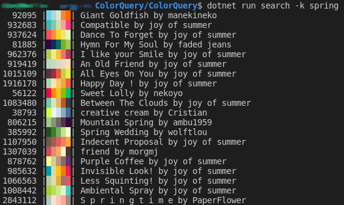
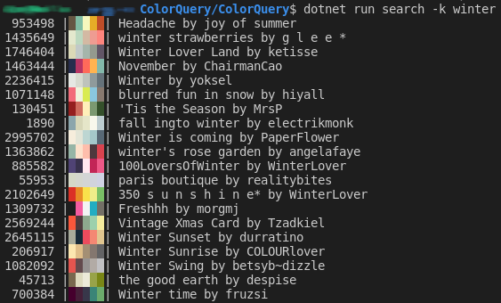
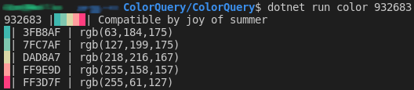

ColorQuery
==========

This is a .NET Core 2.2 console application that uses the [ColourLovers](https://www.colourlovers.com/)
palette API to find color combinations that work together. ColourLovers crowdsources
votes on various color combinations to pick its favorite palettes.

Compile/Run
-----------

```
git clone git remote add origin https://github.com/nemec/ColorQuery.git
cd src/ColorQuery
dotnet build
dotnet run search -k summer
```

Search
------




Multiple hues, hex codes, and keywords can be provided by adding the option again:

    ColorQuery/src/ColorQuery$ dotnet run search --hue green --hue blue

```
ColorQuery/src/ColorQuery$ dotnet run -- search --help
Usage: ColorQuery search [ -s|--sort S ] [ --hue  ... ] [ --hex  ... ] [ -k|--keyword K ... ] [ -h|--help ]
Optional Arguments:
 --hue          Look for palettes matching similar hues. Options: red, orange, yellow, green, aqua, blue, violet, fuchsia
 --hex          Find palettes that contain this color valuel. Up to five 6-character hex codes (e.g. '0xF60A23'. 0x prefix optional)
 -h, --help     Display this help document.
 -k, --keyword  Filter palettes by keyword
 -s, --sort     Choose how results are sorted. Defaults to unspecified order. Options: new, top, random
```


Color Details
------



```
ColorQuery/src/ColorQuery$ dotnet run -- color --help
Usage: ColorQuery color [ -h|--help ] ID
Positional Arguments:
 Id          Colourlovers palette ID, found via a search or their website.

Optional Arguments:
 -h, --help  Display this help document.
```

